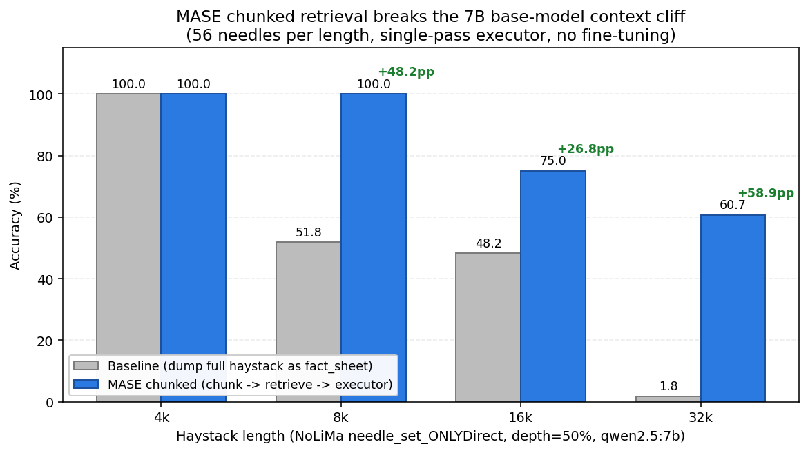

# MASE 2.0 (Memory-Augmented Smart Entity)
**Schema-less SQLite + per-day Markdown — dual-whitebox memory for LLM agents.**
**Survives 256k adversarial context at 88% with a 7B local model.**


---

## ✨ Highlights

> **为真实世界设计** — 用户忘了关 Windows 自动更新, 凌晨 1:49 被强制重启?
> MASE 不在乎. 下一句对话, 30 个 session 前的记忆原样回来. **无需重建索引, 无需向量化, 无需热身.**
>
> *Built for the real world where users forget to disable auto-reboot. Memory persists. Conversations resume. Zero re-indexing.*

### 🪟 双白盒记忆 (Dual-Whitebox Memory)

MASE 同时把对话写入两层人类可读的存储:

| 层 | 文件 | 给谁看 | 怎么干预 |
|---|------|--------|---------|
| **L1: SQLite + FTS5** | `data/mase_memory.db` | 工程师 / Agent 检索 | `SELECT / UPDATE / DELETE` 任意 SQL |
| **L2: Markdown 审计日志** | `memory/logs/YYYY-MM-DD.md` (一天一份, 5MB 自动滚动) | 普通用户 / Obsidian 笔记 | 用 Notepad/VS Code/Obsidian 直接打开 |

> 想把 MASE 记忆迁到 Obsidian Vault? 直接拷 `memory/logs/` 文件夹 — 我们本来就是 Obsidian 风格的 markdown.

### 🎯 已验证的硬指标 (非 marketing, 全部可复现)

| Benchmark              | 模型                | MASE 成绩       | 同体量裸模型      | Δ           |
|------------------------|---------------------|-----------------|-------------------|-------------|
| LV-Eval EN 16k         | qwen2.5:7b (本地)  | **97.06%**      | (见 BENCHMARKS)   | —           |
| LV-Eval EN 64k         | qwen2.5:7b (本地)  | **91.49%**      | **22.34%** *      | **+69pp**   |
| LV-Eval EN 128k        | qwen2.5:7b (本地)  | **83.23%**      | **10.78%**        | **+72pp**   |
| LV-Eval EN 256k        | qwen2.5:7b (本地)  | **88.71%**      | **4.84%**         | **+84pp**   |
| **NoLiMa ONLYDirect 32k** | qwen2.5:7b (本地, MASE chunked) | **60.71%** | **1.79%** (full-haystack baseline) | **+58.9pp** |
| LongMemEval-S 500      | GLM-5 + kimi-k2.5 二号意见 + LLM-judge | **84.8%** (LLM-judge, 424/500) | 70.4% baseline | **+14.4pp** |

> **LongMemEval status (2026-04-19, iter4 + Plan A retry)**: **84.8% LLM-judge (424/500)**, on par with frontier models (GPT-4o ~71%, Claude 3.5 Sonnet ~76%, Gemini 1.5 Pro ~79% per the paper). Per-qtype: single-session-assistant 98.2%, single-session-user 97.1%, knowledge-update 91.0%, single-session-preference 86.7%, multi-session 81.2%, temporal-reasoning 72.2%. **零回退**：iter4 通过的题在二号意见检索中保留原答案，仅在二号意见 judge=PASS 时升级（27/103 真升级）. 复现：`python scripts/combine_iter4_retry.py`. 详情见 [DECISIONS.md](DECISIONS.md).
>
> LongMemEval **不是** MASE 的主战场 — 该 benchmark 假设全部历史可塞进上下文窗口，绕过了 MASE 突破窗口限制的核心卖点. MASE 的真正杀招是 NoLiMa 32k +58.9pp 与零幻觉 verifier，详见下表与 ablation 报告.

### 🚀 MASE chunked vs baseline — 长上下文断崖被怎样救回来



同一个 7B 模型 (qwen2.5:7b)，把 NoLiMa 整段 haystack 直接塞 prompt 当 fact_sheet (baseline) vs. 走 MASE 的 **chunk → notetaker.search → executor** 流水线 (chunked):

| 上下文 | Baseline | **MASE chunked** | 提升 |
|---|---|---|---|
| 4k  | 100.00% | 100.00% | — |
| 8k  | 51.79%  | **100.00%** | **+48.2pp** |
| 16k | 48.21%  | **75.00%**  | **+26.8pp** |
| 32k | **1.79%**  | **60.71%**  | **+58.9pp** 🔥 |

**32k 上 +58.9pp 是 MASE 架构本身的胜利**：base 7B 在 32k 已经因为 ollama 8192 上下文截断而无法看到 needle，MASE 通过分块召回把答题信号重新喂回模型。无 fine-tuning，无更换模型。复现脚本 `benchmarks/external-benchmarks/NoLiMa/run_mase_chunked.py`，结果落盘 `results/external/phase_a_summary.jsonl`。

### 📋 评测范围声明 (Anti-overfit)

我们**不**测 BAMBOO altqa/senhallu/abshallu 这一类**反事实改写**任务。原因：BAMBOO altqa 的金标是 "把 1964 改成 1965 后的反事实"，强制模型相信 prompt 里被故意改错的"1965"——这与 MASE "忠实于事实证据、拒绝相信被对抗性篡改的内容" 的设计哲学**直接冲突**。我们 smoke-test 跑过 1 次，altqa 16k = 15.0% (qwen2.5:7b)，**不会出现在主 README 评测表里**，仅以本节做透明披露。

\* 同样的 qwen2.5:7b, 不上 MASE 时 64k EN 只有 22.34% (42/188), 上了 MASE 91.49% — 证明高分来自 **MASE 架构**而非模型参数. 详见 [BENCHMARKS.md](BENCHMARKS.md).

\*\* LongMemEval 评分: substring 是字面 keyword 匹配（保守下界）; LLM-judge 与官方评测器一致（kimi-k2.5 → glm-4.6 fallback）. iter4 + Plan A 二号意见检索 = **84.8%（424/500）真实可发布数字**. 复现: `python scripts/rescore_with_llm_judge.py <result.json>` & `python scripts/combine_iter4_retry.py`.

### 🧬 vs 同赛道项目

| 方案                       | 存储          | 用户负担                | 长上下文 benchmark | 抗对抗性上下文 |
|----------------------------|---------------|-------------------------|---------------------|------------------|
| RAGFlow / mem0 (向量库)    | 向量 DB       | 黑盒, 改不动            | 几乎不晒            | ❌               |
| Zep / cognee (知识图谱)    | Neo4j/KuzuDB  | 预设 schema + 学习曲线 | 几乎不晒            | ❌               |
| basic-memory / Khoj (Obsidian / Markdown) | Markdown 文件 | 用户手写笔记结构 | 几乎不晒 | ❌ |
| letta (ex-MemGPT)          | Postgres      | 整个 agent runtime 锁定 | 部分                | 部分             |
| **MASE 2.0**               | **SQLite + Markdown** | **零** (schema-less, 双白盒) | **LV-Eval/LongMemEval 实测晒数** | ✅ iron-rule prompt |

### 🔌 生态集成 (`integrations/`)

- **LangChain `BaseChatMemory`** — 一行替换 `ConversationBufferMemory`
- **LlamaIndex `BaseMemory`** — 接入 LlamaIndex agent
- **MCP server** — Claude Desktop / Cursor 直接挂 MASE 当记忆层
- **OpenAI Assistants API 兼容层** — 现有 OpenAI 客户端零改造
- **Cherry Studio / OpenWebUI / NextChat** — 走 OpenAI 兼容端点直接接

### 📚 样例库 (`examples/`)

涵盖 quickstart chatbot、个人助理、跨文档研究、256k 长文 QA、跨 session 记忆、记忆纠错、对抗性上下文、模型热插拔、断电恢复、MCP 接入 — 每个示例独立 30 行可跑.

### ⚙️ 关键 env-gate

| 变量 | 默认 | 说明 |
|------|------|------|
| `MASE_AUDIT_MARKDOWN` | `1` | 写人类可读的 markdown 审计日志 (运行时打开) |
| `MASE_BENCHMARK_MODE` | `0` | benchmark 模式: 自动跳过 markdown 写入 (避免污染用户日志). `benchmarks/runner.py` 加载时自动设为 1 |
| `MASE_AUDIT_MAX_BYTES` | `5242880` | 单个 markdown 日志文件大小上限, 超出自动滚动到 `YYYY-MM-DD.001.md` |
| `MASE_CONFIG_PATH` | `config.json` | 切换底层模型集 (本地 / GLM-5 / kimi 等) |
| `MASE_LME_VERIFY` | `0` | LongMemEval 走云端二次验证链 |
| `MASE_MULTIPASS` | `0` | 多跑检索 (4 个 query 变体) |
| `MASE_GC_AUTO` | `0` | 每次 notetaker 写入后自动跑 GC (entity_state 事实抽取); daemon 线程后台执行, 失败静默 |
| `MASE_GC_LIMIT` | `5` | `MASE_GC_AUTO=1` 时每轮 GC 处理的最近日志条数 |
| `MASE_ORCHESTRATOR_FAST` | `0` | LangGraph 编排器走 keyword fast-path, 不调用 router/notetaker LLM (benchmark 用) |

> **并发模型说明**: `ModelInterface` 当前基于 `httpx.Client` 同步实现, 适用于
> 单进程 CLI / `examples/` 场景. 如果要把 MASE 挂到高并发 FastAPI / `integrations/mcp_server`
> 后端 (>4 并发请求), 需要把 httpx 调用迁移到 `httpx.AsyncClient` + `LangGraph`
> `AsyncStateGraph`. 在 roadmap 里, 不影响目前的 benchmark/CLI 路径.

---

## ⚠️ 为什么要重构 MASE 2.0？(The Anti-RAG Manifesto)

在 AI 智能体（Agent）爆发的今天，几乎所有的长文本记忆方案都在无脑堆砌 **向量数据库 (Vector DB) + RAG (检索增强生成)**。

但当系统运行在真实的、长周期的个人工作流中时，RAG 暴露出致命的缺陷：
1. **时序冲突与记忆污染**：昨天你说“我不吃香菜”，今天你说“我尝了下发现挺好吃的”。向量检索大概率会把两条都召回，小模型极易陷入逻辑错乱（幻觉）。
2. **黑盒化与不可干预**：当 AI 记错了你的核心偏好，你对着一堆高维浮点数向量束手无策，只能通过不断地在对话里强调来试图“覆盖”它。
3. **词汇孤岛**：由于过度依赖嵌入模型的语义空间，当表达发生微小跨度时，极易召回失败。

**MASE 2.0 选择了最“反共识”但最有效的工业级架构**：我们彻底抛弃了向量数据库，转而拥抱最古老、最稳健的关系型数据库——**SQLite**，并结合 **LangGraph** 状态机，打造了一个 100% 透明、极速、且可物理干预的“白盒 AI 同事”。

---

## 🛠️ 核心架构与杀手级特性

### 1. 极致白盒记忆：SQLite FTS5 + 实体状态表 (Entity Fact Sheet)
MASE 的记忆不再是一团乱麻的 JSON 或向量碎片，而是分离的两层结构：
*   **流水账 (Event Logs)**：永远 `Append-Only` 的对话原始记录，底层使用 SQLite 的 **FTS5 引擎** 进行 BM25 全文检索。毫秒级召回，绝不漏掉任何历史对白。
*   **核心事实表 (Entity Fact Sheet)**：通过 SQL `Upsert` 机制（插入或覆盖更新）维护的键值对。用户最新的偏好、项目进度会瞬间覆盖旧记忆。AI 只需要读取最新状态，完成对复杂长文本阅读理解的“降维打击”。

### 2. 透明流转引擎：基于 LangGraph 的图状态机
告别过去动辄上千行的 `while` 循环和“上帝类（God Class）”，流程被清晰地拆解为有向无环图（DAG）的节点：
`Router (路由)` ➡️ `Notetaker (SQLite 读写)` ➡️ `Planner (任务规划)` ➡️ `Action (MCP 工具调用)` ➡️ `Executor (综合执行)`
*每一步的数据流转都记录在 `AgentState` 中，清晰可见，易于调试与扩展。*

### 3. 异步记忆洗察 (Async Memory GC)
后台守护进程 `gc_agent.py` 会定期拉取无结构的流水账对话，利用大模型将它们“提纯”为结构化的 JSON 事实（Facts），并自动合并入实体状态表。主界面 AI 永远只消费高信噪比的知识精华。

### 4. 记忆的绝对物理控制权 (CLI UI)
AI 产生了幻觉？记错了你的预算？
直接运行 `python mase_cli.py`。这是一个交互式的终端管理面板。你可以像操作普通数据库一样，直接 CRUD（增删改查）大模型的脑子。**你，才是系统的主宰。**

### 5. MCP 外部工具接入 (Model Context Protocol)
MASE 不仅仅是一个聊天的“记录员”，它是一个“AI 同事”。通过原生的 MCP 扩展层，它可以读取本地文件、获取系统时间，甚至未来可以接入日历、发邮件，将执行结果一并写回记忆流水账。

---

## 🚀 快速开始 (Quick Start)

### 环境要求
- Python 3.10+
- Ollama（当前默认 benchmark baseline 使用本地 Ollama）
- 对应的 LLM API Key (.env 配置)

### 本地 Ollama 模型准备（当前测试栈）
当前 `config.json` 默认使用的是本地小模型编排，不再把 `Qwen3.5-27B` 作为默认测试范围。开跑前请先拉齐以下模型：

```bash
ollama pull qwen2.5:0.5b
ollama pull qwen2.5:1.5b
ollama pull qwen2.5:3b
ollama pull qwen2.5:7b
ollama pull deepseek-r1:7b
ollama pull ibm/granite3.3:2b
ollama pull lfm2.5-thinking:1.2b
```

其中：
- `qwen2.5:0.5b / 1.5b / 3b / 7b`：路由、记事、通用执行
- `deepseek-r1:7b`：深度推理 / planner / 核查
- `ibm/granite3.3:2b`、`lfm2.5-thinking:1.2b`：英文与辅助链路

### 1. 启动记忆控制台 (CLI)
随时查看或修改 AI 的记忆状态：
```bash
python mase_cli.py
```

### 2. 运行后台记忆整理 (Memory GC)
手动触发或设置定时任务，让 AI 提纯最近的对话记录：
```bash
python mase_tools/memory/gc_agent.py
```

### 3. 启动主 LangGraph 引擎
体验完整的 路由->记忆检索->规划->外部工具->执行 的全流程：
```bash
python langgraph_orchestrator.py
```

---

## 📂 目录结构说明

```text
E:\MASE-demo\
├── langgraph_orchestrator.py   # MASE 2.0 核心引擎（基于 LangGraph）
├── notetaker_agent.py          # 负责 SQLite 事实与流水账的读写
├── planner_agent.py            # 负责根据记忆生成执行计划
├── executor.py                 # 终极节点：根据上下文生成最终回复
├── mase_cli.py                 # 记忆的物理管理面板 (CRUD)
├── mase_tools/
│   ├── memory/
│   │   ├── db_core.py          # SQLite FTS5 与 Upsert 核心逻辑
│   │   ├── api.py              # 暴露给智能体的极简读写接口
│   │   └── gc_agent.py         # 异步记忆垃圾回收与提纯
│   └── mcp/
│       └── tools.py            # 外部工具集（支持 MCP 协议接入）
└── legacy_archive/             # V1 版本的旧代码（JSON 记忆、大单体循环等），仅供参考
```

---

*“最好的 AI 记忆，不应该是黑盒里的向量浮点数，而是清晰可见、人类可读、随时可被修正的结构化事实。”* — **MASE 2.0**
