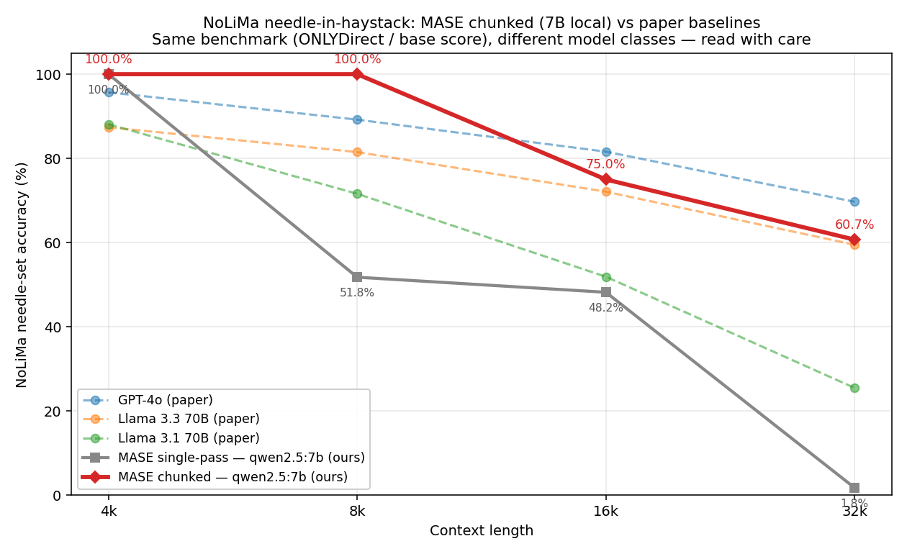

<div align="center">

# MASE
**A dual-whitebox memory engine for LLM agents.**
**88.71% on LV-Eval 256k with a local 7B model.**

> 🚫 **No vector black-boxes.** MASE turns agent memory into an inspectable,
> editable, benchmarked engineering system built around SQLite, Markdown, and
> explicit fact management.


-red)


<a href="../README.md"><b>中文</b></a> | <b>English</b>



</div>

## What MASE Is

MASE is a **dual-whitebox memory engine for LLM agents**.

It splits agent memory into two controlled surfaces:

- **Event Log** for retrieval and raw conversation history
- **Entity Fact Sheet** for the latest structured facts that can overwrite stale state

This means MASE is not primarily trying to stuff more context back into the model. It is trying to clean up conflicting facts first, then pass only the minimum necessary facts into the model.

## Why Not Black-Box Memory

MASE rejects black-box vector memory as the default answer because:

1. Facts change over time.
2. Memory you cannot inspect is memory you cannot debug.
3. Long-context performance is first a context-governance problem, not just a window-size problem.

## How MASE Works

MASE's primary narrative is the memory system, not a runtime feature list.

- **SQLite + FTS5** for raw event-log recall and structured fact storage
- **Markdown / tri-vault** for human-readable auditability and portability
- **Entity Fact Sheet** for fact replacement over fact accumulation
- **Runtime Flow**: Router → Notetaker → Planner → Action → Executor

## Evidence

| Benchmark | Model | MASE | Naked baseline | Δ |
|---|---|---|---|---|
| LV-Eval EN 256k | qwen2.5:7b local | **88.71%** | **4.84%** | **+84pp** |
| NoLiMa ONLYDirect 32k | qwen2.5:7b local, MASE chunked | **60.71%** | **1.79%** | **+58.9pp** |
| LongMemEval-S 500 | GLM-5 + kimi-k2.5 verifier | **61.0% official substring** / **80.2% LLM-judge** | **70.4% substring** / **72.4% LLM-judge** | **+7.8pp judge** |

> LongMemEval reports two scoring lanes (see `docs/benchmark_claims/`):
> - 61.0% (305/500) — official substring-comparable lane
> - 80.2% (401/500) — LLM-judge lane, same iter2 full_500 run
> - 84.8% (424/500) — post-hoc combined/retry diagnostic, **not** the public headline

- MASE is not just able to remember; it can distill facts reliably under long context.
- Architecture, not parameter count, determines whether long context remains usable.
- This is not a concept demo; it is an engineering project shaped by benchmarks and audits.

## Quick Start

```bash
git clone https://github.com/zbl1998-sdjn/MASE.git
cd MASE
pip install -e ".[dev]"
python -m pytest tests/ -q
python mase_cli.py
```

If you are just getting started, begin with `python mase_cli.py`.

For deeper reproduction commands, see [BENCHMARKS.md](../BENCHMARKS.md).
For the full demo list, see [examples/README.md](../examples/README.md).

## Integrations

- LangChain `BaseChatMemory`
- LlamaIndex `BaseMemory`
- MCP server
- OpenAI-compatible endpoint

```python
from integrations.langchain.mase_memory import MASEMemory

memory = MASEMemory(thread_id="zbl1998::main", top_k=8)
agent_executor.invoke({"input": "What was my budget again?"}, config={"memory": memory})
```


## Limitations

MASE is currently strongest at fact updates, cross-session memory, consistency control, and whitebox debuggability.

It is not a terminal solution for generic semantic retrieval, especially in these scenarios:

- synonym- and paraphrase-heavy semantic generalization
- large-scale document-level semantic recall
- high-concurrency server runtime (the current main path still favors CLI / benchmark / single-process use)


## Roadmap

- Whitebox semantic retrieval
- Stronger async / server-grade runtime
- More benchmark triangulation
- More integrations

## Contributing

MASE welcomes contributions. If you'd like to help, please consider:

- Adding new model backends
- Re-running benchmarks and submitting reproducible results
- Building integrations (LangChain, LlamaIndex, MCP, etc.)
- Reporting real-world long-memory failure cases with reproducible traces

### Citation

```bibtex
@software{mase2026,
  author = {zbl1998-sdjn},
  title = {{MASE}: Memory-Augmented Smart Entity — Schema-less SQLite memory for LLM agents},
  year = {2026},
  url = {https://github.com/zbl1998-sdjn/MASE},
  note = {Lifts qwen2.5:7b from 1.79\% to 60.71\% on NoLiMa-32k; 61.0\% official substring / 80.2\% LLM-judge on LongMemEval-S}
}
```

## 💡 A Note from the Developer

Honestly — I'm just a newcomer who picked up large-language-model knowledge **only 3 months ago**.

Along the way I came to a conviction: when people stand in front of an unfathomably powerful **black-box AI**, the **fear they feel often outweighs the wonder**. We're afraid it will quietly rewrite our memories, afraid it will hallucinate in ways we can't trace, and afraid we'll lose control.

That's exactly why MASE walked away from the giant black box and chose **dual-whitebox**. In this system:

> **No "lone-hero" omnipotence — only "many hands, each doing what they do best".**

We don't ask one giant model to do everything. Instead, a 2.72 MB lightweight kernel strings together **Router / Notetaker / Planner / Action / Executor**, letting each small model play to its strengths. Precisely because MASE keeps the architecture this simple, it leaves room for what comes next: multi-agent collaboration, MCP integrations, and a plug-in ecosystem.

**The beauty of open source is that no single person has to be perfect.** If you share the values of transparency, minimalism, and collaboration, welcome to MASE.

— *zbl1998-sdjn, Spring 2026*
